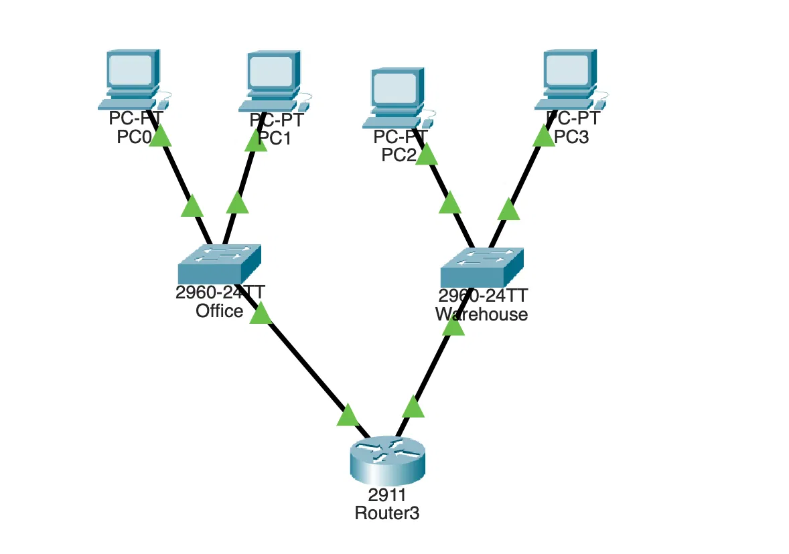
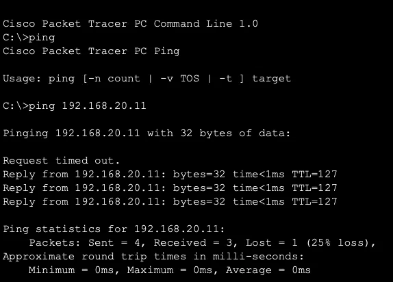

 Multi-Subnet Network Lab (Cisco Packet Tracer)

A small business network with two departments, Office and Warehouse, on separate subnets connected through a router. The router hands out IP addresses automatically with DHCP.

## Setup
- **Router:** Cisco 2911 (R1)
- **Switches:** Two Cisco 2960s, one per department
- **Office subnet:** 192.168.10.0/24 (gateway 192.168.10.1)
- **Warehouse subnet:** 192.168.20.0/24 (gateway 192.168.20.1)
- **DHCP:** Configured on the router with a separate pool for each subnet. The first 10 addresses in each subnet are reserved.

## Testing
Pinged a Warehouse PC from an Office PC to confirm traffic crosses the router between subnets.

The first ping timed out while the PC used ARP to find the router's physical address. The rest succeeded. The TTL of 127 (down from 128) confirms the packets passed through one router.

## Problems I Ran Into
- **Router interfaces were off by default.** The links stayed red until I enabled each port with `no shutdown`.
- **Commands failing after leaving config mode.** I accidentally dropped back to privileged mode (`R1#`), where configuration commands are rejected. I learned to check the prompt before each command.
- **The setup wizard.** I skipped the initial configuration dialog and configured everything manually through the CLI.

## Next Steps
- Add VLANs to segment traffic on the switches
- Secure the router with passwords and SSH access
# multi-subnet-network-lab
